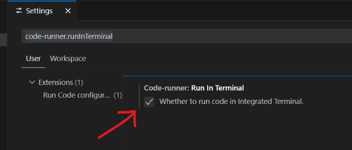
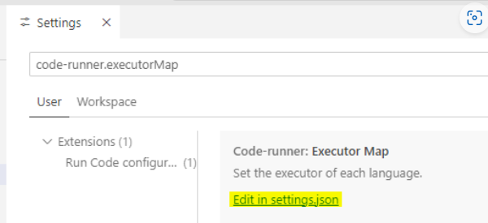
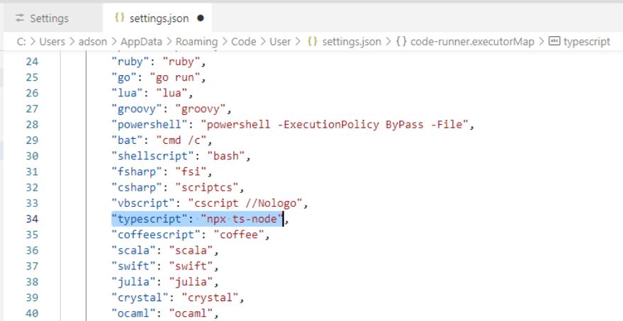

# Documentação Técnica do Sistema de Gerenciamento de Biblioteca

**Nome do Projeto:** Sistema de Biblioteca em TypeScript
**Tecnologias Utilizadas:** TypeScript, Node.js, readline-sync, JSON, Decorators, POO
**Camadas do Sistema:** Apresentação, Negócio, Dados

---

### 1. Objetivo Geral

Desenvolver um sistema de gerenciamento de biblioteca com suporte ao cadastro, empréstimo e devolução de livros, utilizando recursos avançados da linguagem TypeScript, como classes abstratas, interfaces, enumerações, serialização, reflexão e recursividade.

---

### 2. Estrutura do Projeto

```
biblioteca/
├── src/
│   ├── controllers/         # Ponto de entrada e interface com o usuário (via console)
│   ├── database/            # Responsável por persistência (simulada em memória ou JSON)
│   ├── interfaces/          # Interfaces para padronizar comportamento
│   ├── models/              # Entidades: Livro, Usuario, Emprestimo
│   ├── services/            # Regras de negócio e repositórios
│   └── utils/               # Funções auxiliares (log, backup, busca recursiva)
├── package.json
├── tsconfig.json
└── README.md
```

---

### 3. Funcionalidades Implementadas

* Cadastro de livros e usuários com validação de dados.
* Realização de empréstimos e devoluções.
* Consulta ao acervo.
* Backup e restauração dos dados via serialização JSON.
* Busca recursiva por título de livro.
* Registro de logs via decorators e reflexão.

---

### 4. Principais Componentes

#### 4.1. Models (Entidades)

* `Livro` com enum `CategoriaLivro`
* `Usuario` com enum `TipoUsuario`
* `Emprestimo` com enum `StatusEmprestimo`

#### 4.2. Interfaces e Abstrações

* `ICrud<T>`: define as operações de CRUD
* `IBusca<T>`: define operações de busca por termo ou ID
* `RepositorioBase<T>`: implementação base genérica usando `Map`

#### 4.3. Repositórios

* `LivroRepositorio`, `UsuarioRepositorio`, `EmprestimoRepositorio`
* Decorados com `@LogarMetodo` para gerar logs via reflexão

#### 4.4. Utilitários

* `buscaRecursiva.ts`: busca item em coleção com recursão
* `LogarMetodo.ts`: decorator para logging automático
* `backup.json`: arquivo de persistência de dados serializados

---

### 5. Execução e Uso

#### Scripts (package.json):

* `start`: Executa o sistema com `ts-node`
* `build`: Compila TypeScript para JavaScript

#### Comando:

```bash
npm install
npm run start
```

---

### 6. Considerações Finais

* O sistema é modular e facilmente expansível.
* Reflete boas práticas de programação orientada a objetos.
* Os logs e o backup garantem rastreabilidade e integridade dos dados.
* Pode ser migrado para um banco de dados real com TypeORM futuramente.

---

### 7. Contribuidores

* Anderson Félix de Araújo Júnior
* Eduardo Oliveira Gomes da Silva
* Víctor Emannuel de Souza Teixeira

---

<!-- ## configurar projeto TS
```
Set-ExecutionPolicy RemoteSigned -Scope CurrentUser
npm init -y
npm i typescript --save-dev
npx tsc --init
npm i -g ts-node
npm i --save-dev @types/readline-sync
npm i readline-sync
npm i @types/readline-sync
```

Para compilar todos os arquivos ts em js, execute no terminal:
```npx tsc```<br>
Para executar um arquivo em específico, execute no terminal:
```node ./pasta/arquivo.js```<br>
ou podemos instalar a extensão code runner do VSCode e executar o typescript diretamente<br>
Ainda no VSCode, acesse o menu File > Preferences > Settings e na caixa de busca digite: code-runner.runInTerminal e marque a caixa como na imagem abaixo:

Ainda em Settings e na caixa de busca digite: code-runner.executorMap e clique no link edit in settings como na imagem abaixo:

No arquivo que settings.json, procure pela chave "typescript" e adicione o prefixo npx antes do comando ts-node, como na imagem abaixo. Depois salve (CTRL+S):
 -->
