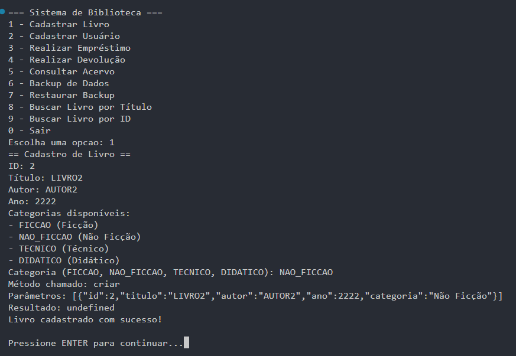
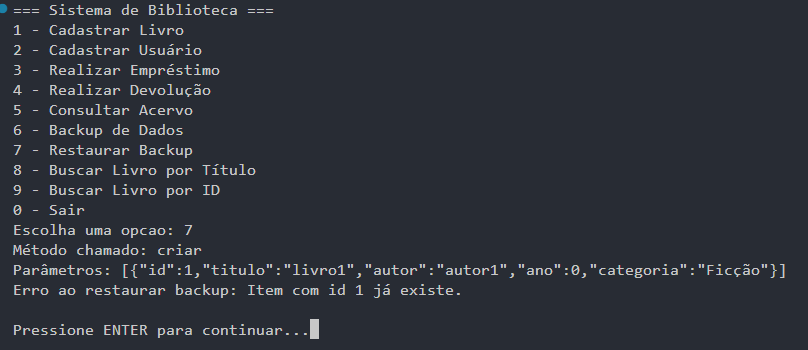

# Testes realizados no console

## Cadastrar livro

## Cadastrar Usuário

## Realizar Empréstimo

## Realizar Devolução

## Consultar Acervo

## Backup de Dados

## Restaurar Backup

## Buscar Livro por Título

## Buscar Livro por ID
